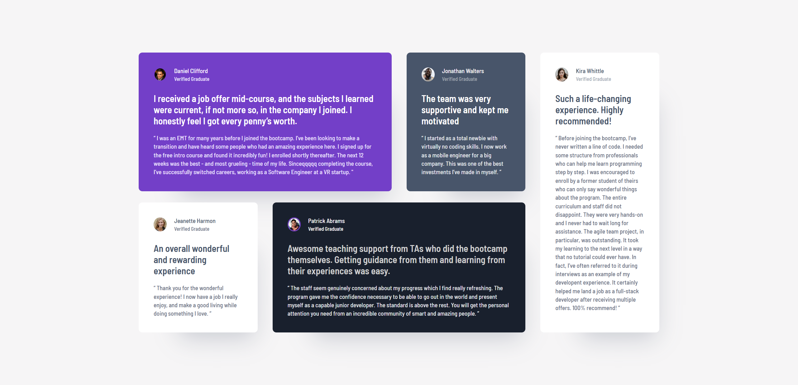

# Frontend Mentor - Testimonials grid section solution

This is a solution to the [Testimonials grid section challenge on Frontend Mentor](https://www.frontendmentor.io/challenges/testimonials-grid-section-Nnw6J7Un7). Frontend Mentor challenges help you improve your coding skills by building realistic projects.

## Table of contents

- [Overview](#overview)
  - [The challenge](#the-challenge)
  - [Screenshot](#screenshot)
  - [Links](#links)
- [My process](#my-process)
  - [Built with](#built-with)
  - [What I learned](#what-i-learned)
  - [Continued development](#continued-development)
  - [Useful resources](#useful-resources)
- [Author](#author)

## Overview

### The challenge

Users should be able to:

- View the optimal layout for the site depending on their device's screen size

### Screenshot

#### Desktop view

#### Mobile view

### Links

- Solution URL: [Github repo](https://github.com/simeon2002/FEM-testimonials-grid-section)
- Live Site URL: [Testimonials section](https://simeon2002.github.io/FEM-testimonials-grid-section/)

## My process

### Built with

- Semantic HTML5 markup
- CSS custom properties for design system
- Flexbox
- CSS Grid
- Mobile-first workflow
- BEM architecture

### What I learned

- Difficulties encountered?
- Questions?
- What would you do better next time?
- Learnings/takeaways
  - Used grid-auto-flow for first time to position element in empty space
  - In this case f.e. we have a `"` pattern in the background. So in the HTML I think _“does this elements provide meaningful content or is it just for visual presentation?”_ Since it is the later, I think… Okay **_Do i add a non-semantic element and pollute the HTML or use a pseudo element to style this? → I choose the second of course._**
  - At the end messed up a little bit → was applying padding to section elements but then added a div container which also had padding, so they were added together. Problem: I rewired the display grid on body to center the main element, which was a mistake. → elements began to overflow due to height: 100vh on body → I fixed it but to make it better, best to remove the display grid, assign padding and max-width to the container wrapper element that I added. (and initially it was on section and that is why I started changing the code with display:grid on body element…) all in all it works and I know how to fix it…

### Continued development

### Useful resources

- [Example resource 1](https://www.example.com) - This helped me for XYZ reason. I really liked this pattern and will use it going forward.
- [Example resource 2](https://www.example.com) - This is an amazing article which helped me finally understand XYZ. I'd recommend it to anyone still learning this concept.

**Note: Delete this note and replace the list above with resources that helped you during the challenge. These could come in handy for anyone viewing your solution or for yourself when you look back on this project in the future.**

### AI Collaboration

Describe how you used AI tools (if any) during this project. This helps demonstrate your ability to work effectively with AI assistants.

- What tools did you use (e.g., ChatGPT, Claude, GitHub Copilot)?
- How did you use them (e.g., debugging, generating boilerplate, brainstorming solutions)?
- What worked well? What didn't?

**Note: Delete this note and the content above if you didn't use AI, or replace with your own experience.**

## Author

- Frontend Mentor - [@simeon2002](https://www.frontendmentor.io/profile/simeon2002)
- Twitter - [@SimeonSeraf1mov](https://x.com/SimeonSeraf1mov)
